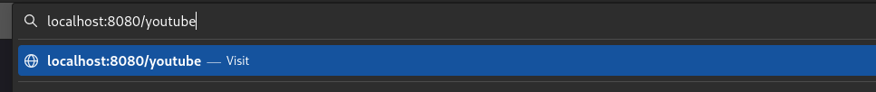
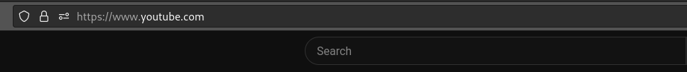

## Cutter
### Made by Julieanb
## 17.12.2023

- An independent project, Cutter, whose goal is to study the file structure of go projects.

- The application offers the user the ability to give links aliases, 
and stores this in a database. When accessing the server using this alias, 
the server redirects to the original link.

- POST and DELETE requests use /url/{youralias} url, GET request use /{youralias}

- SQLite was used as a database.

- Chi was used as router.

- Slog is used to log errors.

- The program uses ports 8080.

## Makefile targets

- all: Starts the server and database.

- test: Collects tests and displays the result in the console.

- clean: Clears port 8080.

## Examples

### --I--

Example of work.

### --II--

Example of POST.

